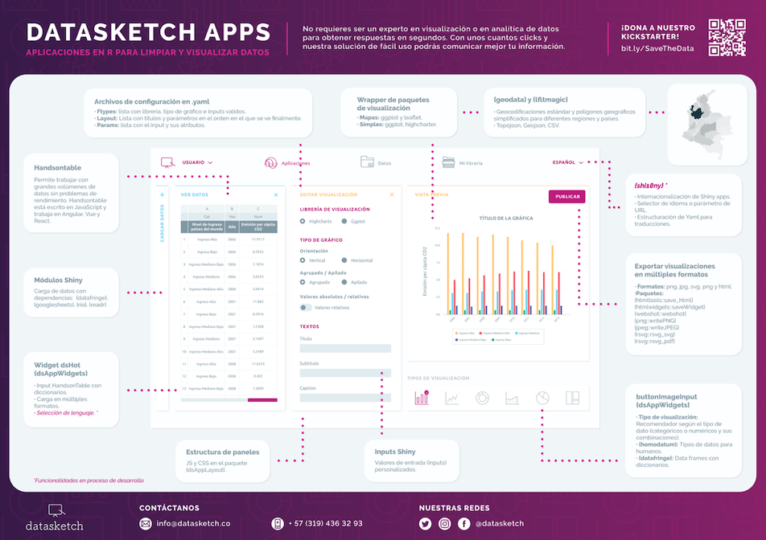

We are building data visualization and analysis Shiny Apps that are (hopefully) very easy to use for non-tech users.

We embarked on a quest to make data science more accessible for non-coders. In 2019 2e launched a successful [kickstarter campaign](https://www.kickstarter.com/projects/datasketch/savethedata) to democratize data visualization for people with non-programming experience. Nos after some months of development we are seeing live the first versions of our self-services data visualization and analysis tools.

Since then we have launched [Datasketch Apps](http://datasketch.co), an open source data visualization software as service, in this process we have been developing several [R packages](/packages-and-libraries) to help us build multiple data visualization apps at scale.

Here is a general structure of how we envisioned the R packages to build the Shiny Apps, it was presented in the 2019 Latin R conference, for a current list of the different packages we are developing check out [this page](/packages-and-libraries)

