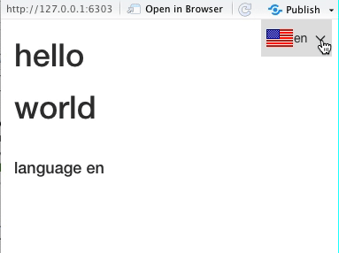
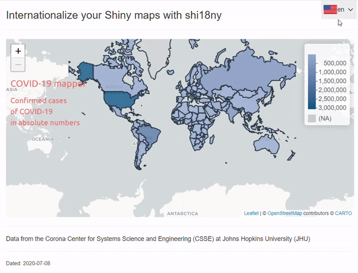

At [Datasketch](http://datasketch.co), we want to make data science more accessible and more inclusive, and we believe that one of the big challenges in bringing the data to the people is about translating the language in which the information is presented. 

For more accessibility and inclusion, we need
easy ways to create data visualization and analysis tools so that non-coders and non-statisticians can understand data; and
the ability to **internationalize** this information: to translate these tools into multiple languages and communicate the information to people all across the world.

To solve this problem, we have created `shi18ny` (read: ‘shiny internationalization’), a package to translate your Shiny apps into 15 different languages - and we’re constantly working to add more!

> Can’t wait to find out more about the package and don’t want to read our motivational thoughts? Simply jump to the [documentation of the package](https://shi18ny.datasketch.dev/). Here you also find a list of all currently available languages.* Or watch our [UseR2020 talk](https://user2020.r-project.org/program/posters/) on youtube: Shi18ny, Internationalization for Shiny Apps.




## Motivation

Breaking down the confusing masses of data that are available about global issues, such as the development of cases of the coronavirus, and making them available online through data visualization tools is crucial. In recent times [Data Visualization has gone mainstream](https://www.fastcompany.com/90450827/its-official-data-visualization-has-gone-mainstream) up to the point where some charts like ["Flatten the curve" are becoming iconic](https://www.forbes.com/sites/evaamsen/2020/04/29/how-flatten-the-curve-is-on-its-way-to-become-a-historic-disease-image) and coranavirus dashboards are now everywhere on the web, or at least in the English speaking part of the web.

Many of the global databases, dashboards and platforms are written in English, looking at some estimates from the year 2008, we find that at that point around [a third of the population of the world spoke English](https://www.cambridge.org/core/journals/english-today/article/two-thousand-million/68BFD87E5C867F7C3C47FD0749C7D417). While this is a large number in absolute terms - and it is likely to have grown since then - we are still excluding the majority of the world’s population by catering only for the English-speaking part. And clearly, only a fraction of the English-speaking population speak English as their first language making it potentially difficult for the remaining part to truly understand the information and consequences communicated about global issues such as the corona crisis.

This is why at Datasketch we wanted to come up with a way to translate data visualization apps in Shiny into other languages so that people all over the world can inform themselves about important global issues without having to be statisticians, mathematicians, or coders, and importantly, without having to know how to speak English.

And yes, you could write a shiny app in your own language, but wouldn't it be nice to do it in multiple languages at once?


## How `shi18ny` was born

To get inspiration for the implementation of a package that could put these concepts into practice, we looked around at other programming languages to see what’s already out there and came across the `NodeJS` `i18n` package (link: https://github.com/nodejs/i18n). This gave us some ideas towards the general implementation, we decided to enable translations in our package using _a dictionary with common data science terms_ for easy keyword translations, and using `.yaml` files to enable custom translations of words and phrases not included in the dictionary, or to overwrite existing translations.

Based on these ideas `shi18ny` was born. Let’s have a look at how you can use `shi18ny` to translate your own Shiny app.

**But before we continue**, we won’t leave you hanging any longer… you have probably been asking yourself since the beginning of this post - what on earth is the ‘18’ doing in `shi18ny`? As it turns out, there are 18 characters between the **i** and the **n** in the word **internationalization**. As simple as that.

Don’t believe us? Here’s a tiny program to prove our point :)

```{r}
nchar("nternationalization")
paste0("i", nchar("nternationalizatio"),"n")
```


## How to use `shi18ny`

### Get started

To get started you need to install `shi18ny` in R. The easiest way to do this is to use the `remotes::install_github()` function. Note that the `remotes` package needs to be installed before you can run this function.


```{r install-github}
# install.packages("remotes")
remotes::install_github("datasketch/shi18ny")
```
If you are looking to install the package in order to contribute, you can go to the package documentation and follow the steps in the Getting Started (link) guide.


### Basic examples

Before we start thinking about our Shiny app, let’s have a look at the base translation function that `shi18ny` uses for all translations. With the `i_` function, you can translate key words in the shape of strings, vectors and lists in the console. The following examples all use the default dictionary, as we haven’t defined any custom translations yet.

```{r basic-example}
# 1. translate a string
i_("hello", lang = "de")

# 2. translate a vector
i_(c("hello", "world"), lang = "de")

# 3. translate a list - use the ‘keys’ parameter to define one or more keys that should be translated
i_(list(id = "hello", translate = "world"), lang = "es", keys = "translate")
```
But what about words that aren’t in the dictionary or that you want to translate in a way that differs from the standard translation in the dictionary? For those we create a `yaml` file with custom translations. 

Let’s say, for example, that we want to be a bit more enthusiastic when we translate the English word ‘hello’ into German. Instead of ‘Hallo’, we want the translation to  be ‘Hallöchen!’. We also want to add a translation for the expression ‘how_are_you’ which is currently not in the dictionary (as this only includes keywords). All you have to do is create a `locale` directory in which you store your .yaml files with custom translations. In this case we are translating between English and German, so we will create a `locale/en.yaml` and a `locale/de.yaml` file for these custom translations. Let’s look at one of these files to see what the format looks like.

```{yaml yaml-custom-translations}
# de.yaml
myslang:
  how_are_you: Wie geht's?
hello: Hallöchen!
```
We can then translate our keywords using these custom translations just like we did before, as long as the .yaml files are in the correct file location.

```{r custom-example}
# use custom translations
i_(c("hello", "myslang.how_are_you"), lang = "de")
```
You can see that ‘hello’ was now translated with ‘Hallöchen!’ instead of as ‘Hallo’. To translate ‘how_are_you’, we had to include ‘myslang.’ to navigate through the nested .yaml file.

Now that we’ve understood the basic functions, let’s take a look at some other functions you need to configure your Shiny translations, and how you can combine it all in your `app.R` code to create your international data app. 


### Translate your app with `shi18ny`

Let’s talk about the key functions you need to be aware of when internationalizing your app. First we’ll go through the functions that you’ll need to include in your UI, and next those that go in the Server part of your app. 


#### UI

Let’s look at the UI code of a very basic Shiny app and talk about the functions that we’re using.

```{r ui-example}
ui <- fluidPage(
  useShi18ny(),
  langSelectorInput("lang", position = "fixed"),
  h1(ui_("hello")),
  uiOutput("results")
)
```

First of all, there’s the `useShi18ny()` function which you always need to include in the UI part of your app to initialize the package. This runs the required client side javascript code to update translations.

If you want to include a language selector widget in your app, you also need to include the `langSelectorInput` function in your UI. You can leave this out if you only want the users of your app to be able to change the language by adding a query parameter to the URL (for example: your_app_url.com/?lang=de).

To directly translate text within the UI of your app, it needs to be wrapped in the `ui_` function. This uses the `i_` function we talked about earlier to translate text in the UI. When the language gets changed by the user, the `ui_` function gets updated by `uiLangUpdate` in the Server, which we’ll have a look at in a minute.

In this example, we will include a `renderUI` in the Server for an output called ‘results’ to translate some more text in the app. This is why we included `uiOutput` in our UI.

#### Server

Server
For our very simple international Shiny app, the code for the corresponding Server look like this:

```{r server-example}
server <- function(input, output, session) {
  i18n <- list(
    defaultLang = "en",
    availableLangs = c("en", "de"),
    localeDir = "locale",
    fallbacks = shi18ny:::default_fallbacks,
    queryParameter = "lang"
  )

  lang <- callModule(langSelector,"lang", i18n = i18n, showSelector = TRUE)

  observeEvent(lang(),{
    uiLangUpdate(input$shi18ny_ui_classes, lang())
  })

  output$results <- renderUI({
    list(
      h1(i_("how_are_you",lang())),
      br(),
      h4(i_("language",lang()), lang())
    )
  })
}

```

First, we tell the `i18n` parameter how we want to configure our languages. Here we can define which language we want to have as our default language (`defaultLang`) and which languages should be available for translation (`availableLangs`); if we decide to include a language selector widget in our app, the available languages are those that will appear in the selector. By default this includes all 15 available languages.

With the `localeDir` parameter we can change the file location of our custom translation `.yaml` files. The default directory is “locale” so if you don’t include this parameter you can still just add your custom translation files in a directory called “locale”.

For some languages there may be gaps in the dictionary. You can use the `fallbacks` parameter to define another language to be used for the language that is currently selected for translation in case a particular word is missing in that language. 

*If you notice any gaps in our dictionary and would like to help us fix those gaps, you can do so  by contributing to `shi18ny` (see [How to contribute](https://shi18ny.datasketch.dev/articles/contributing.html/)) - we always greatly appreciate any help in improving our translations.*

By passing a string to `queryParameter` you can define the parameter users need to use to translate your app through the URL. This defaults to ‘lang’ so that users need to add `/?lang=d` to the URL to translate the app to German.

Next we need to create a reactive (here we’ve called it `lang()`) which is updated as soon as the user selects a different language. We do this by calling the `langSelector` module and passing it the `i18n` configuration parameter we have just defined. We also connect it to our `langSelectorInput` by calling its id, and we choose here to actually show the language selector in our app by setting `showSelector` to be true.

If we want to make translations directly in our UI using the `ui_` function, we need to make sure that we update the language used in `ui_` within the Server as soon as the user changes it. This is made sure in our example code by the `uiLangUpdate` function wrapped in an `obsobserveEvent` that depends on our reactive `lang()`.

Last but not least we have a bit of code defining our `output`. In this case we’re just rendering some text that we have translated using the `i_` function. 

### Basic example app

Now that we’ve looked at the individual building blocks we can put it all together in our app. Note that we’ve got a few custom translation in here - we’ve included the `.yaml` files we defined earlier to have a translation of ‘how_are_you’ and to overwrite the standard translation of ‘hello’.

```{r basic-app-example, echo=FALSE}
library(shiny)
library(shi18ny)

shinyApp(

ui <- fluidPage(
  useShi18ny(),
  langSelectorInput("lang", position = "fixed"),
  h1(ui_("hello")),
  uiOutput("results")
)

server <- function(input, output, session) {
  i18n <- list(
    defaultLang = "en",
    availableLangs = c("en", "de"),
    localeDir = "locale",
    fallbacks = shi18ny:::default_fallbacks,
    queryParameter = "lang"
  )
  lang <- callModule(langSelector,"lang", i18n = i18n, showSelector = TRUE)
  observeEvent(lang(),{
    uiLangUpdate(input$shi18ny_ui_classes, lang())
  })

  output$results <- renderUI({
    list(
      h1(i_("how_are_you",lang())),
      br(),
      h4(i_("language",lang()), lang())
    )
  })
}

options = list(height = 500)
)
```

### COVID-19 example app



We’ve seen how `shi18ny` can be used to translate a few keywords in a simple Shiny app. But earlier we talked about internationalizing important information to communicate global issues, so let’s look at an example of something a little more meaningful (and a little more complicated).

Note that if you want to run the below example yourself, you also need to install our `lfltmagic` package, with which you can straightforwardly create beautiful leaflet maps for your Shiny apps. You can install it from our [Github page](https://github.com/datasketch/lfltmagic).

```{r covid-app-example, echo=FALSE}
library(shiny)
library(ggplot2)
library(dplyr)
library(leaflet)
library(shi18ny)
library(lfltmagic)

shinyApp(

load_data <- read.csv("tidy-csse-langs.csv")

max_date <- max(load_data$date)

data <- load_data %>%
  group_by(country) %>%
  filter(date == max_date) %>%
  select(iso_alpha3, confirmed, country, en, de, es)

ui <- fluidPage(

  useShi18ny(),
  langSelectorInput("lang", position = "fixed"),
  h3(ui_("internationalize")),
  hr(),
  fluidRow(
    column(6,
           leafletOutput(outputId = "world_map")
    )),
  hr(),
  h5(ui_("annotate")),
  hr(),
  uiOutput("datestamp")
)

server <- function(input, output) {

  i18n <- list(
    defaultLang = "en",
    availableLangs = c("de","en","es")
  )

  lang <- callModule(langSelector,"lang", i18n = i18n, showSelector = TRUE)

  observeEvent(lang(),{
    uiLangUpdate(input$shi18ny_ui_classes, lang())
  })

  output$world_map <- renderLeaflet({

    country = i_("country", lang())
    cases = i_("cases", lang())

    lflt_choropleth_Gcd(data,
                        map_tiles = "CartoDB",
                        tooltip = paste0("<b>",country,":</b> {",lang(),"} </br> <b>",cases,":</b> {confirmed}"),
                        palette_colors = c("#99f2c8", "#1f4037"),
                        branding_include = TRUE,
                        title = i_("title", lang()),
                        subtitle = i_("subtitle", lang())
                        )
    })

  output$datestamp <- renderUI({
    h6(paste0(i_("status",lang()), ": ", max_date))
    })

}


options = list(height = 500)
)
```

Hopefully we’ve convinced you that you should start using `shi18ny` to internationalize your Shiny data visualization apps. 

If so, head over to the [package documentation](https://shi18ny.datasketch.dev/) to find out even more about the package (or if you would like to contribute), or watch our [UseR2020 talk](https://user2020.r-project.org/program/posters/) on youtube: [shi18ny: Internationalization for Shiny Apps](https://www.youtube.com/watch?v=IVSCQHcTFLQ).


