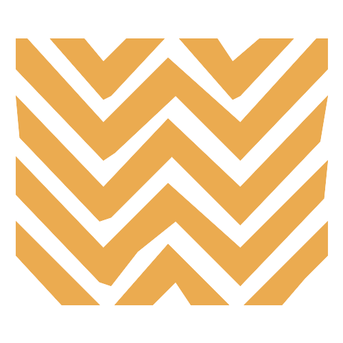
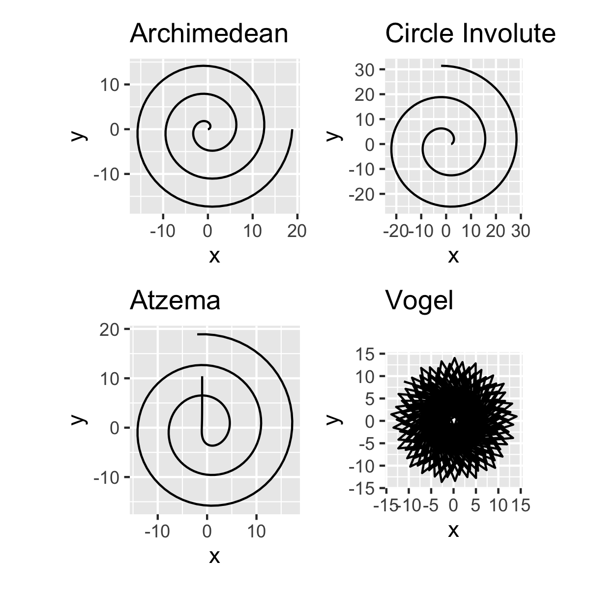
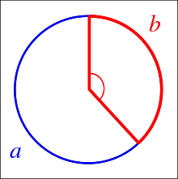

It all started a few months ago. We started collaborating with an organization doing indigenous journalism in Colombia. We wanted to find some balance between the numbers and the identity of the different indigenous communities we were working with.

Here is the result, in this post we will tell you how we got there from a boring census spreadsheet to show numbers that did well in representing the communities.


_Out of a thousand colombians 44 belong to an indigenous community_


[Check out the full investigation](https://www.agendapropia.co/mujer-palabra-resistencia/) where these visualizations are featured, available en Spanish and the different languages of the three communities: Wayuu, Gunadule and Tikuna.

We feel it is very important as a data team to support social organizations and journalists to show the realities of vulnerable groups. It usually happens that these groups make the headlines in rare ocasions when very unlikely events happen, such as the coverage by [The Economist](https://www.economist.com/obituary/2020/05/28/antonio-bolivar-died-on-april-30th) and the [New Yorker](https://www.newyorker.com/news/daily-comment/the-death-of-antonio-bolivar-an-indigenous-elder-in-the-amazon-rainforest) of the death of Antonio Bolívar, the last member of a community in the Amazon who became famous for his role in the oscar nominated movie The Embrace of The Serpent.


<blockquote class="twitter-tweet"><p lang="en" dir="ltr">A jaguar&#39;s farewell to Karamakat: Antonio Bolivar, Ocaina indigenous man who played leading role in Oscar-nominated film &quot;Embrace of the Serpent&quot;, has died at age 75 of coronavirus in the Amazonian town of Leticia via <a href="https://twitter.com/felipedjeguaka?ref_src=twsrc%5Etfw">@felipedjeguaka</a> <a href="https://t.co/Ubl6iPCn0Q">https://t.co/Ubl6iPCn0Q</a> <a href="https://t.co/vuESZakeBA">pic.twitter.com/vuESZakeBA</a></p>&mdash; Glenn H. Shepard (@TweetTropiques) <a href="https://twitter.com/TweetTropiques/status/1256261482817507333?ref_src=twsrc%5Etfw">May 1, 2020</a></blockquote> <script async src="https://platform.twitter.com/widgets.js" charset="utf-8"></script> 


In an effort to put a human face to the stories of indigenous women in Colombia who live at the border with countries like Venezuela, Brazil, Perú and Panamá. We embarked with the help of the team at [Agenda Propia](http://agendapropia.co) in a path to connect raw numbers and data buried in statistical census with the faces, photographs, narrative stories and visual elements of those communities in the Amazon, the Guajira desert and the Darien region. 

> The visual elements we decided to use were those emerging from their ancestral fabrics and patterns.



_380.460 are Wayuu in the Colombian side of them are women 197.140, their language: Wayuunaiki. There are 542.043 Wayuus at both sides of the Colobian-venezuelan bolder_


We decided to make a data visualization that portraied indigenous patterns and their different proportions from different census numbers. The idea for this visualizations made sense to accompany the stories. So we started looking at ways to arrange dots in patterns, aesthetically the circle provided a great arrangement, so **we were left to find a way to pack circles that looked organic.**

We thought of arranging the dots in a spiral, here where the code starts. We didn't know there were [so many possibilities for creating spirals](https://en.wikipedia.org/wiki/List_of_spirals). Here are a few:

- Archimedean spiral
- Circle involute
- Atzema spiral
- Logarithmic spiral
- Vogel spiral

The logarithmic spiral was out of question, as we wanted a spiral that looked dense and with somewhat constant desnsity along a circle. Vogel spiral is not really a spiral, but more on that later. And the Atzema spiral for large `n` approximates the Archimedean spiral and starts with an asymptote that one can tweak.  


The code of the spirals is pasted here but can be found here: [script.R](script.R)
```
archimedean_spiral <- function(n, a = 0, b = 1, turns = 3){
  # b separation of turns
  t <- seq(0, turns  * 2 *pi, length.out=n)
  x <- (a + b*t) * cos(t)
  y <- (a + b*t) * sin(t)
  d <- tibble::tibble(x, y)
  d$n <- 1:n
  d
}

circle_involute <- function(n, a = 2){
  # https://mathworld.wolfram.com/CircleInvolute.html
  t <- seq(0,5*pi, length.out=n)
  x <- a * (cos(t) + t * sin(t))
  y <- a * (sin(t) - t * cos(t))
  d <- tibble::tibble(x, y)
  d$n <- 1:n
  d
}

atzema_spiral <- function(n, turns = 3){
  t <- seq(0, turns * 2 *pi, length.out=n)
  x <- sin(t)/t - 2 * cos(t) - t * sin(t)
  y <- cos(t)/t - 2 * sin(t) + t * cos(t)
  d <- tibble::tibble(x, y)
  d$n <- 1:n
  d
}

vogel_spiral <- function(n){
  t <- 1:n
  r <- sqrt(t)
  golden_angle <- pi * (3 - sqrt(5))
  theta <- t * golden_angle
  x <- r * cos(theta)
  y <- r * sin(theta)
  d <- tibble::tibble(x, y)
  d$n <- 1:n
  d
}

```

Here you see samples of the spirals above.



We need spirals that work fine with different number of points, in the tens or even in the thousands of points. We tried to use the convolute circle but with the Archimedean spiral one can have a bit more controls on the number of turns and their separation.

Let's see how the Archimedean spiral looks for different numbers of points. Note that when we see the spirals not as paths but as points we get a different picture. For our specific use case we needed points that filled a circle in a uniform way, independent on the number of points we use, for this we went ahead and made more tweaks to our funcition such that we could approximate the arc in the Archimedean spiral so we could keep it constant.


We were not happy with the arrangements of points for different `n`. The end of the spiral always look as if something is missing, it doesn't give the impression that the dot fill a circle in a smooth way.

That's when we turned to the [Vogel spiral](https://www.codeproject.com/Articles/1221341/The-Vogel-Spiral-Phenomenon). The Vogel spiral takes into account the [Golden Angle](https://en.wikipedia.org/wiki/Golden_angle), which is like the golden ratio but along two arcs in a circle, and starts adding points every `137.5077...` degrees or `pi ( 3 - sqrt(5))` radians and scaling the radious by `sqrt(n)`



The pattern looks very organic, and works beutifully with any given `n`, just make sure you adjust the size of the points that works for you for different values of `n`.


Enjoy some more patterns from indigenous communities.


_This is the Gunadule pattern, indigenous community in the border of Panama and Colombia, there are 2610 members of this community_ 


_There are 13.842 Tikunas en Colombia, they live in the Amazon_ 


If you are curious about the animations we simply set up the patterns as polygones and used [{transformr}](https://github.com/thomasp85/transformr)


